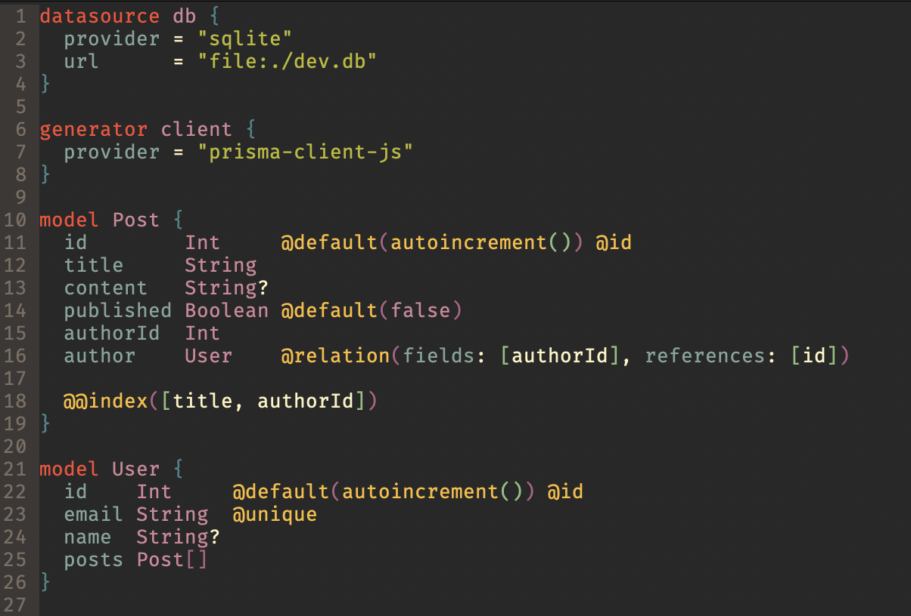

# prisma-mode
Major mode targeting the Prisma Schema Language ([PSL][psl]). Prisma Schema is used by [Prisma 2.0][prisma] to generate client libraries, migrate your 
datasources, and much more. 

prisma-mode automatically load for `.prisma` files.


## Features
* Syntax highlighting 
* Code formatting
* Linting *(soon)*

## Screenshot


## Installation

### Manual
Clone repository and add the following to your init.el
```elisp
(load-file "/{cloned-path-to}/prisma-mode/prisma-mode.el")
```
OR

```elisp
;; More robust in case more `.el` files are added to mode
(add-to-list 'load-path "/{cloned-path-to}/prisma-mode/")
(autoload 'prisma-mode "prisma-mode" nil t)
```

### Melpa
Package not yet available

## Formatting & Linting
Formatting and linting are provided via `prisma-fmt`

### Enable auto-formatting
Add the following to your init.el
```elisp
(setq prisma-format-on-save t)
```
Formatting is also available via the `prisma-fmt-buffer` function which you can bind to whatever keymapping you want.


## Misc. 
### Installing `prisma-fmt`
Prisma publishes the binaries for multiple platforms but they don't seem to list them in their documentation. After downloading you simply need to add the executable to your `$PATH`. 

<div align="center">
  <h3>Binaries</h3>
  <a href="https://binaries.prisma.sh/master/latest/darwin/prisma-fmt.gz">Mac OS X</a>
  <span>&nbsp;&nbsp;•&nbsp;&nbsp;</span>
  <a href="https://binaries.prisma.sh/master/latest/windows/prisma-fmt.exe.gz">Windows</a>
  <span>&nbsp;&nbsp;•&nbsp;&nbsp;</span>
  <a href="https://binaries.prisma.sh/master/latest/debian-openssl-1.1.x/prisma-fmt.gz">Linux</a>
  <span>&nbsp;&nbsp;•&nbsp;&nbsp;</span>
  <a href="https://binaries.prisma.sh/master/latest/rhel-openssl-1.1.x/prisma-fmt.gz">CentOS/RHEL</a>
</div>

Example for Mac:
```sh
wget https://binaries.prisma.sh/master/latest/darwin/prisma-fmt.gz # Or URL for different platform
gunzip prisma-fmt.gz
chmod +x prisma-fmt
mv prisma-fmt /someplace/listed-in/${PATH}
```

[prisma]: https://www.prisma.io/
[psl]: https://www.prisma.io/docs/reference/tools-and-interfaces/prisma-schema/prisma-schema-file
